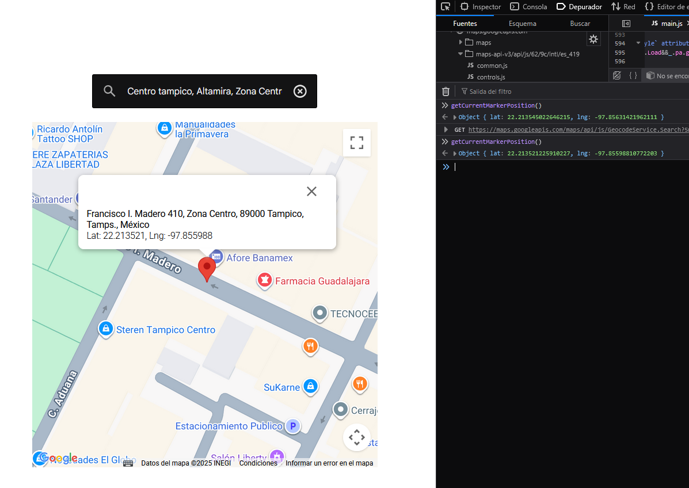

# Google Maps JavaScript API

Se generó una API KEY correctamente limitada para consumir la api de maps de google. `https://console.cloud.google.com/`

Existen 3 formas para utilizar los servicios, en este caso se utiliza la etiqueta de carga de script directo. La etiqueta de carga directa de scripts carga todas las bibliotecas solicitadas a la vez, el rendimiento puede verse afectado en algunas aplicaciones. 

## Places

Place Autocomplete es una función de la biblioteca de Places de la API de Maps JavaScript. Puedes usarla para incluir en tus aplicaciones el comportamiento de escritura anticipada del campo de búsqueda de Google Maps. 
El servicio de autocompletado puede buscar coincidencias para palabras completas y subcadenas para resolver nombres de lugares, direcciones y Plus Codes. Así, las aplicaciones pueden enviar búsquedas a medida que el usuario escribe para proporcionar predicciones de lugares en el momento. 

## Resultado

Busqueda de dirección y al seleccionar coloca un Pin, se puede actualizar la posicion y obtener las coordenadas. Utiliza la ultima versión de Places

